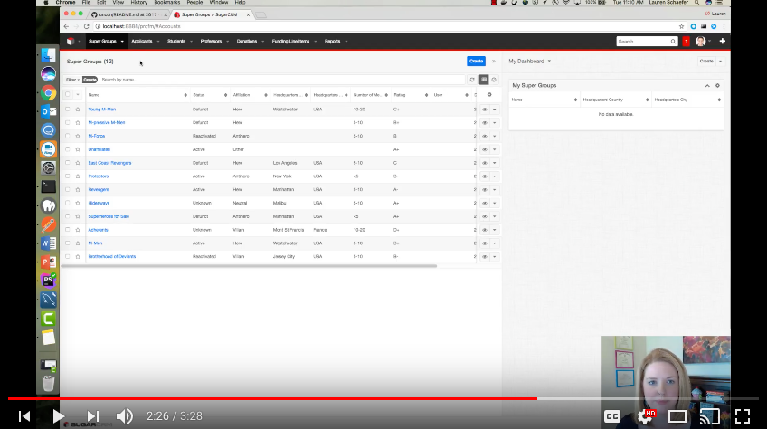
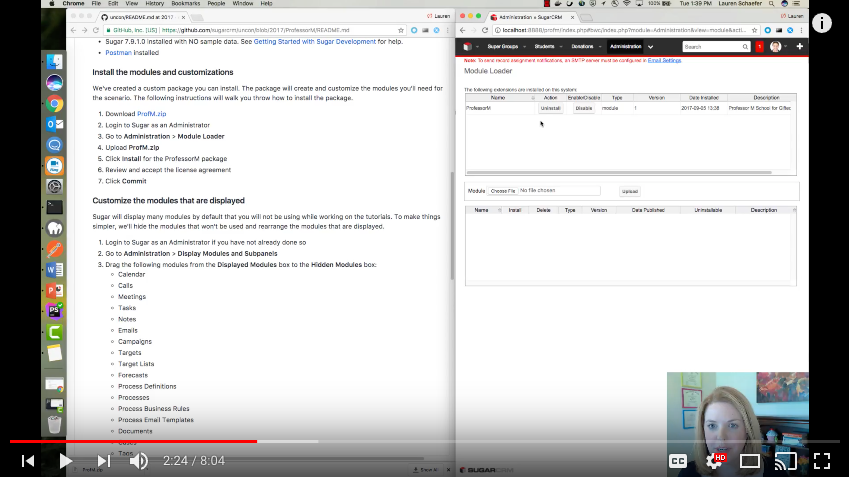
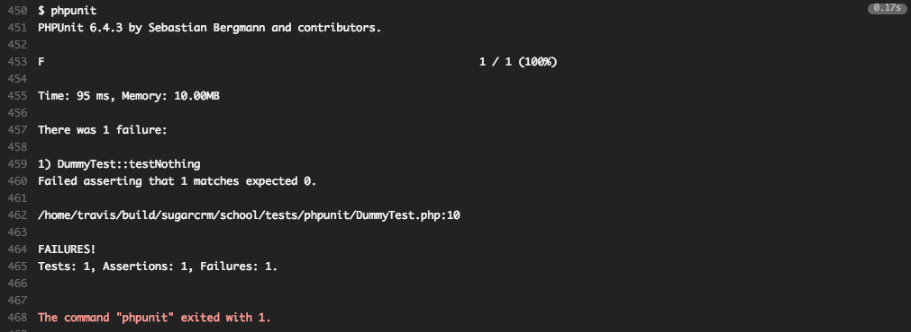

# Professor M's School for Gifted Coders [](https://travis-ci.com/sugarcrm/school)

All of the tutorials at UnCon 2017 will be based on Professor M's School for Gifted Coders.  The following sections will explain more about the scenario and how to install the required modules and sample data.

## Contents
[About the scenario](#about-the-scenario) 

[Installation instructions](#installation-instructions) 

[Continuous integration with Travis CI](#continuous-integration-with-travis-ci) 

[Automated tests](#automated-tests)

[How to fix your Sugar instance without starting completely over](#how-to-fix-your-sugar-instance-without-starting-completely-over)

## About the scenario
Professor M aka Professor Marum has created an exclusive not-for-profit school for gifted coders.  

The school uses Sugar for the following use cases:
- Managing applicants, current students, former students, and professors
- Tracking super groups
- Soliciting donations from alumni and alumni affiliated super groups

For those familiar with Sugar, you'll notice that some of the standard modules have been renamed.

| Professor M Module | Original Sugar Module |
| :--- | :--- |
| Super Groups | Accounts |
| Applicants | Leads |
| Students | Contacts |
| Professors | New custom person-type module |
| Donations | Opportunities |
| Funding Line Items | Revenue Line Items|

Get all of the details on the Professor M scenario in the video below.
[](https://youtu.be/aKBTKcaney4 "The Professor M Scenario Part 1 - What is it and why should you care?")

## Installation instructions

Before beginning any of the tutorials associated with UnCon 2017, you'll want to setup a Sugar instance that has the Professor M scenario installed.

Watch the video below for instructions on how to install the scenario.  Text-based instructions follow.
[](https://youtu.be/SO-Rav35X5U "The Professor M Scenario Part 2 - How do you install it?")

### Prerequisites
- Sugar 7.9.1.0 installed with NO sample data.  See [Getting Started with Sugar Development](https://developer.sugarcrm.com/getting-started) for help.
   * Note:  If you install Sugar using ***config_si.php***, ensure that the `disable_unknown_platforms` property is set to `false` or is not in the file.
   * Note for Windows users:  Make the path to your Sugar instance as short as possible to avoid errors of file paths being too long.
- [Postman](https://www.getpostman.com) installed 

### Install the modules and customizations
We've created a custom package you can install.  The package will create and customize the modules you'll need for the scenario.  The following instructions will walk you throw how to install the package.
1. Download [ProfM.zip](/ProfessorM/ProfM.zip)
1. Login to Sugar as an Administrator
1. Go to **Administration** > **Module Loader**
1. Upload **ProfM.zip**
1. Click **Install** for the ProfessorM package
1. Review and accept the license agreement
1. Click **Commit**
   * Hint for Windows users:  If you receive a warning with the message "Full extraction path exceed MAXPATHLEN (260)...", try the following:
     1. Install [ProfM.zip for Windows](/ProfessorM/windows/ProfM.zip).
     1. In your Sugar instance, create the following directories if they do not already exist: [YourSugarDirectory]\custom\modules\Opportunities\clients\base\views\subpanel-for-pmse_bpmprocessdefinition-opportunities_locked_fields_link
     1. Download [subpanel-for-pmse_bpmprocessdefinition-opportunities_locked_fields_link.php](/ProfessorM/windows/subpanel-for-pmse_bpmprocessdefinition-opportunities_locked_fields_link/subpanel-for-pmse_bpmprocessdefinition-opportunities_locked_fields_link.php)
     1. Move the file you just downloaded in the step above to [YourSugarDirectory]\custom\modules\Opportunities\clients\base\views\subpanel-for-pmse_bpmprocessdefinition-opportunities_locked_fields_link
     1. Navigate to **Administration** > **Repair** > **Quick Repair and Rebuild**.
   * If the above installation still fails due to a MAXPATHLEN error, you may need to remove other files with long names from the zip file.
     1. Determine which files are too long.  Hint:  you can see the full paths of the files in the manifest.
     1. Unzip ProfM.zip.
     1. For each file that needs to be removed, remove it from the unzipped copy of ProfM.zip.
     1. For each file that needs to removed, remove the corresponding entry in the manifest, taking note of where the files should be eventually installed (indicated by 'to').
     1. Zip the ProfM directory, ensuring that the manifest is at the root of the zip and is NOT enclosed in another directory.
     1. Install the newly zipped ProfM.zip.
     1. Move the files you removed from the zip to the appropriate locations in your local Sugar directories.
     1. Navigate to **Administration** > **Repair** > **Quick Repair and Rebuild**.
   
   
### Customize the modules that are displayed
Sugar will display many modules by default that you will not be using while working on the tutorials.  To make things simpler, we'll hide the modules that won't be used and rearrange the modules that are displayed.
1. Login to Sugar as an Administrator if you have not already done so
1. Go to **Administration** > **Display Modules and Subpanels**
1. Drag the following modules from the **Displayed Modules** box to the **Hidden Modules** box:
   * Calendar
   * Calls
   * Meetings
   * Tasks
   * Notes
   * Emails
   * Campaigns
   * Targets
   * Target Lists
   * Forecasts
   * Processes
   * Process Business Rules
   * Documents
   * Cases
   * Tags
1. Rearrange the items in the **Displayed Modules** box so they are in the following order from top to bottom:
   * Accounts
   * Leads
   * Contacts
   * Professors
   * Opportunities
   * Revenue Line Items
   * Quotes
   * Reports
   * Process Email Templates
   * Process Definitions
1. Click **Save**

### Use the Sugar REST API to create the Professor M sample data
In order to create the Professor M sample data, you'll use Postman to run a collection of Sugar REST API calls.  Each call in the collection has one or more simple tests associated with it to ensure the call was successful.
1. Save a copy of [ProfessorM_PostmanCollection.json](https://raw.githubusercontent.com/sugarcrm/uncon/2017/ProfessorM/ProfessorM_SampleData/ProfessorM_PostmanCollection.json)
1. In Postman, click **Import**
1. Click **Choose Files** and import **ProfessorM_PostmanCollection.json**
1. Click the gear icon in the upper right corner and select **Manage Enviornments**
1. Click **Add** 
1. Input a name for your environment (for example, **Professor M**)
1. Add the following keys and values:
   * url: the url of your Sugar installation (for example, http://localhost:8888/profm)
   * rest_endpoint:  /rest/v10
   * username:  the username for an admin user in your Sugar installation
   * password:  the password associated with the username above
1. Click **Add**
1. Close the **Manage Environments** dialog
1. Click **Runner**
1. Select the **ProfessorM Sample Data** collection
1. Ensure the environment you just created is selected
1. Click **Run ProfessorM S...**
1. Wait for the collection to finish running. All tests should pass.
   Hint:  If you see many failures, you may have forgotten to install the modules and customizations using ProfM.zip.  See instructions in previous section for how to do the install.

## Continuous integration with Travis CI
This repository is configured to work with [Travis CI](https://docs.travis-ci.com/user/for-beginners/).  Whenever a commit
is pushed to the repository or a Pull Request is made, Travis CI will automatically kick off a build.

### Viewing results in Travis CI

You can view the Travis CI build results at [https://travis-ci.com/sugarcrm/school](https://travis-ci.com/sugarcrm/school).

### Viewing results in GitHub

You can view the latest build status at the top of this README ([](https://travis-ci.com/sugarcrm/school)).  
Clicking on the build status will open the detailed results in Travis CI.

You can also view build results in Pull Requests.  Toward the bottom of each Pull Request, you can click "Show all 
checks" to see the Travis CI build results for that Pull Request.  


You can then click Details to open the build results in Travis CI.


### About the build

The build is configured in [.travis.yml](.travis.yml). Currently, the build runs two jobs:
- Execute the PHPUnit tests (see [PHPUnit tests](#phpunit-tests) for details)
- Execute the Jasmine tests (see [Jasmine tests](#jasmine-tests) for details)

We hope to expand the build to do more (like deploy Sugar) in the future.

## Automated tests
This repository contains automated PHPUnit and Jasmine tests that can be executed manually or as part of a
 [Travis CI](http://travis-ci.com) build.

### PHPUnit tests
[PHPUnit](https://phpunit.de/) is a testing framework for PHP.  The PHPUnit test files are located in 
[/tests/phpunit](tests/phpunit).  The [/tests/phpunit](tests/phpunit) directory can contain 
multiple test files, and each test file can contain multiple tests.

### Manual execution
To manually execute the tests, you will need to install PHPUnit on your machine.  See 
[Getting Started with PHPUnit](https://phpunit.de/getting-started.html) for details.

You'll also need to install [Composer](https://getcomposer.org/) to manage your dependencies.  See 
[Download Composer](https://getcomposer.org/download/) for instructions on how to download Composer to your machine.  
Then execute the following command from your `school` directory in order to install the test dependencies:
```
composer install
```

If you need to update the namespaces, manually update [composer.json](composer.json) and then run the following command from
your `school` directory:
```
./composer.phar update
```

The PHPUnit tests can be executed by running the following command from your `school` directory on macOS:
```
vendor/bin/phpunit
```
or on Windows:
```
vendor\bin\phpunit
```

### Automatic execution
The PHPUnit tests are automatically run as part of the Travis CI build process.  Travis CI's default build script
for PHP is PHPUnit, so we don't have to include anything special in [.travis.yml](.travis.yml) in order for the tests 
to run.  However, we have added `composer install` to [.travis.yml](.travis.yml) in order for the dependencies to be 
installed on the build machine. Travis CI looks in [phpunit.xml](phpunit.xml) for the PHPUnit config.  Our config 
indicates that the PHPUnit tests are stored in [tests/phpunit](tests/phpunit).  

#### Interpreting the results
To see the results of the tests that are run as part of the Travis CI build, open the build in Travis CI.  If the build 
passed, you know all of the tests passed.


To see the detailed test results, click the PHP build job to expand it:


You can scroll through the job log to see the results of the PHPUnit tests.


If the build failed, a variety of things could have caused the failure including a failing PHPUnit test.


If a PHPUnit test fails, you'll see something like the following in the job log.




### Jasmine tests
[Jasmine](https://jasmine.github.io/) is a testing framework for JavaScript.  We have included a very simple Jasmine 
test in this repository as an example.

The tests are located in [/tests/jasmine](tests/jasmine).  Currently, there is one test inside of the 
[DummySpec.js](tests/jasmine/DummySpec.js) test file.  The [/tests/jasmine](tests/jasmine) directory can contain 
multiple test files, and each test file can contain multiple tests.

### Manual execution
To manually execute the tests, you will need to install a few different things on your machine before you can run the 
tests. 

#### Setup

Begin by navigating to your school directory and then execute the following commands. 

Install phantomJS.  See [PhantomJS's Downloads Page](http://phantomjs.org/download.html) for other ways to download
and install.
```
brew install phantomjs
```

Install the Grunt command line interface.  See [Grunt's Getting Started Guide](https://gruntjs.com/getting-started) 
for more details.
```
npm install -g grunt-cli
```

Install Grunt in your local school project.
```
npm install grunt
```

Install Jasmine.
```
npm install grunt-contrib-jasmine
```

#### Execution
Inside of your `school` directory, execute the following command to run the Jasmine tests:
```
grunt test-js
```

See 
[Grunt's Getting Started Guide](https://gruntjs.com/getting-started) 
for more details.

### Automatic execution
The Jasmine tests are automatically run as part of the Travis CI build process.  Travis CI will automatically look
for a script named "test" inside of [package.json](package.json).  In our case, the test script calls the "test-js" task
defined in [Gruntfile.js](Gruntfile.js).  The "test-js" task only has one task:  jasmine.

#### Interpreting the results
To see the results of the tests that are run as part of the Travis CI build, open the build in Travis CI.  If the build 
passed, you know all of the tests passed.


To see the detailed test results, click the Node.js build job to expand it:


You can scroll through the job log to see the results of the Jasmine tests.


If the build failed, a variety of things could have caused the failure including a failing Jasmine test.


If a Jasmine test fails, you'll see something like the following in the job log.


## How to fix your Sugar instance without starting completely over

As you customize this instance, you may do something like accidentally write broken code that seems to break your Sugar instance.  Try running **Quick Repair and Rebuild**:
1. Log in as an administrator.
1. Click your profile picture in the upper-right corner and select **Administration**.
1. In the **System** section, click **Repair**.
1. Click **Quick Repair and Rebuild**.

If you become unable to login to your Sugar instance or running **Quick Repair** does not work, try the following:

1. Remove the custom code that is causing problems.
1. Delete the contents of the `cache` directory.
1. Use a program like MySQL Workbench to truncate the `metadata_cache` table.
1. Access your Sugar instance in a browser. If you still receive an error, reload the page.

If the above steps do not fix your problem, you may need to start over.  Delete your Sugar root directory and follow the steps in the Installation Instructions above.
